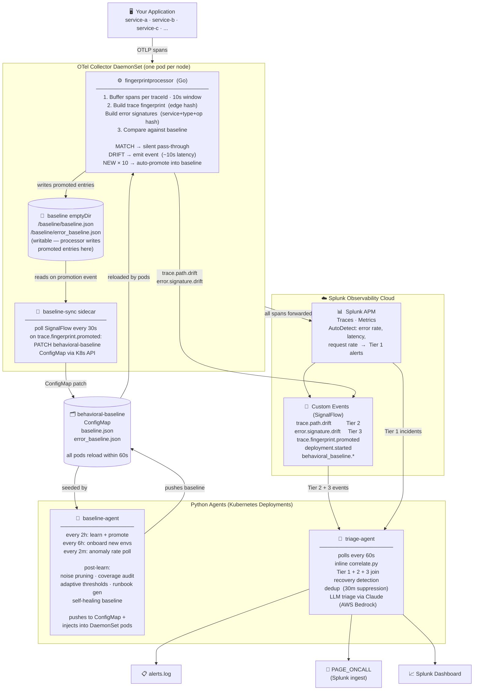

# Behavioral Baseline — Anomaly Detection for Splunk Observability

**Augments Splunk APM AutoDetect** with structural and behavioral detection that metric thresholds cannot catch. Splunk's built-in AutoDetect already covers error rate, latency, and request rate anomalies for every APM-enabled service. This framework adds a second layer on top:

- A service that has never called your database suddenly does
- A known DB caller goes completely silent
- A request now flows through a new service it never touched before
- An error type that has never appeared before fires for the first time

Fully generic — no hardcoded service names. Everything is auto-discovered from the live APM topology.

---

## Architecture



### Detection latency by path

| Path | How | Latency |
|------|-----|---------|
| **OTel edge → `poll_drift_events --triage` → `agent.py`** | Tails collector logs via SSH — no Splunk indexing wait. Kill-to-verdict in demo mode. | **~15–30s** (10s detect + 5s settle + ~10s Claude) |
| **OTel edge → `triage-agent`** | Processor detects on first affected trace, event lands in Splunk, triage-agent inline-correlates and calls LLM | **~60–90s** (15s detect + 30s index + 60s poll cycle) |
| **OTel edge → inline `correlate.py`** | Tier 2/3 events joined with Tier 1 AutoDetect incidents inside triage-agent | **~1–2 min** (triage-agent poll cycle) |
| **Splunk AutoDetect → inline `correlate.py`** | Native metric alerts joined with Tier 2/3 events | **~3–7 min** (metric aggregation + poll cycle) |

### Baseline lifecycle

```
baseline-agent Deployment                          ←── long-running, no CronJobs needed
  every 2h:
    python3 core/trace_fingerprint.py learn + promote
      └─▶ data/baseline.<env>.json
    python3 core/error_fingerprint.py learn + promote
      └─▶ data/error_baseline.<env>.json
    post-learn: noise pruning → coverage audit → adaptive thresholds
                baseline monitor (auto-fix) → runbook gen → dedup pruning
                self-healing (auto re-learn after incident resolves)
    push:
      kubectl delete/create behavioral-baseline ConfigMap
      kubectl cp baseline into each otelcol-fingerprint pod
  every 6h:
    onboard.py --auto  (discover new environments, provision detectors)
  every 2m:
    IncidentTracker: monitor anomaly rate → trigger immediate re-learn on incident

OTel processor auto-promotion                      ←── continuous, threshold=10

  Trace path drift:
    NEW hash × 10  ──▶  /baseline/baseline.json  (emptyDir, this pod)
                   ──▶  trace.fingerprint.promoted  (kind=trace)
                           └─▶ baseline-sync sidecar
                                 └─▶  ConfigMap patch (both files)
                                       └─▶  all pods reload within 60s

  Error signature drift:
    NEW hash × 10  ──▶  /baseline/error_baseline.json  (emptyDir, this pod)
                   ──▶  trace.fingerprint.promoted  (kind=error)
                           └─▶ baseline-sync sidecar
                                 └─▶  ConfigMap patch (both files)
                                       └─▶  all pods reload within 60s
```

---

## Repo structure

```
o11y-behaviorbaseline/
├── agent.py                  ← unified agent (perception-action loop, AWS Bedrock/Claude)
├── collect.py                ← all data fetching (topology, anomalies, SLO, deployments)
├── baseline.py               ← baseline data layer (load, summarize, health, learn, promote)
├── onboard.py                ← provisioning + detector management
├── watch_otel_events.py      ← fast-path triage: queries OTel edge events from Splunk
│
├── demo/                     ← demo scripts, guides, and presentation assets
│   ├── DEMO_GUIDE.md               ← step-by-step demo walkthrough
│   ├── check-ready.sh              ← pre-flight check (6 conditions)
│   ├── demo-reset.sh               ← full reset before first demo
│   ├── demo-between.sh             ← between-demo reset (--db / --quick flags)
│   ├── demo-quick-reset.sh         ← fast local-only reset (~5s)
│   ├── demo_watch.py               ← hands-off loop: detect → triage → correlate
│   ├── poll_drift_events.py        ← tails OTel logs via SSH — live or --triage mode
│   ├── notify_deployment.py        ← CI/CD hook (emits deployment.started + re-learn)
│   ├── build_deck.py               ← generates Behavioral_Baseline_Deck.pptx
│   └── Behavioral_Baseline_Deck.pptx
│
├── core/                     ← detection engine
│   ├── trace_fingerprint.py        ← Tier 2: trace path drift
│   ├── error_fingerprint.py        ← Tier 3: error signature drift
│   ├── correlate.py                ← Tier C: cross-tier correlation (also used inline by triage-agent)
│   └── provision_detectors.py      ← Tiers 1b/3/4: SignalFlow detectors
│
├── agents/                   ← long-running Deployment agents + standalone helpers
│   ├── baseline_agent.py           ← Deployment: learn/onboard/heal lifecycle (replaces CronJobs)
│   ├── triage_agent.py             ← Deployment: inline correlation + LLM triage, polls every 60s
│   ├── baseline_healer.py          ← auto re-learn baseline after incident resolves
│   ├── adaptive_thresholds.py      ← per-service threshold tuning
│   ├── hypothesis_engine.py        ← BFS root cause ranking
│   ├── dedup_agent.py              ← anomaly flood deduplication
│   ├── deployment_risk_scorer.py   ← pre-deploy risk score
│   ├── drift_explainer.py          ← edge-by-edge trace diff with LLM explanation
│   ├── multi_env_correlator.py     ← cross-environment anomaly propagation
│   ├── coverage_auditor.py         ← per-root-op baseline coverage
│   ├── slo_impact_estimator.py     ← error budget burn rate
│   ├── runbook_generator.py        ← generates RUNBOOK.<env>.md via Claude
│   ├── noise_learner.py            ← learns app-specific noise patterns
│   ├── baseline_monitor.py         ← baseline health checks (stale, contaminated, dupes)
│   └── onboarding_advisor.py       ← traffic classification + config recommendations
│
└── data/                     ← runtime state (gitignored)
    ├── baseline.<env>.json
    ├── error_baseline.<env>.json
    ├── dedup_state.<env>.json
    ├── otel_dedup_state.<env>.json
    └── thresholds.json
```

---

## Requirements

- Python 3.10+
- Splunk Observability Cloud account with APM enabled
- Services instrumented with OpenTelemetry (traces flowing)
- `SPLUNK_ACCESS_TOKEN` — an API token with read+write access
- `SPLUNK_INGEST_TOKEN` — an ingest token for writing custom events (falls back to `SPLUNK_ACCESS_TOKEN`)
- `SPLUNK_REALM` — your realm (e.g. `us1`, `eu0`)
- `boto3` — for the unified agent's Claude calls (`pip install boto3`)

---

## Quick start

```bash
git clone https://github.com/mqbui1/o11y-behaviorbaseline.git
cd o11y-behaviorbaseline

export SPLUNK_ACCESS_TOKEN=your_token_here
export SPLUNK_REALM=us1

# Onboard an environment: provisions detectors + builds baselines + sets up cron
python onboard.py --environment your-env

# Run the unified agent (single cycle)
python agent.py --environment your-env

# Run continuously, every 5 minutes
python agent.py --environment your-env --poll 5
```

---

## The unified agent

`agent.py` is the primary entry point. It runs a perception-action loop every cycle:

1. **Perceive** — fetches anomaly events, topology, deployments, SLO status, baseline health, open incidents
2. **Reason** — one Claude call (AWS Bedrock) synthesizes everything into a structured assessment
3. **Act** — executes Claude's action plan

```bash
python agent.py --environment petclinicmbtest              # single cycle
python agent.py --environment petclinicmbtest --poll 5     # every 5 minutes
python agent.py --environment petclinicmbtest --dry-run    # perceive + reason, no actions
python agent.py --environment petclinicmbtest --json       # print Claude's raw plan
```

Example output when an incident is detected:

```json
{
  "assessment": "vets-service is missing from traces after the 14:03 deploy",
  "severity": "INCIDENT",
  "root_cause": "Deployment of vets-service v2.1 introduced a startup crash",
  "affected_services": ["vets-service", "api-gateway"],
  "confidence": "HIGH",
  "actions": [
    { "type": "PAGE_ONCALL",       "service": "vets-service", "reason": "service missing from all traces" },
    { "type": "SUPPRESS_ANOMALY",  "service": "api-gateway",  "reason": "downstream effect of vets-service failure" }
  ],
  "narrative": "vets-service stopped appearing in traces at 14:03, immediately after a deployment..."
}
```

Action types: `NO_ACTION`, `SUPPRESS_ANOMALY`, `RELEARN_BASELINE`, `EMIT_EVENT`, `PAGE_ONCALL`, `UPDATE_THRESHOLD`.

---

## Detection tiers

| Tier | Source | What it detects | How |
|------|--------|----------------|-----|
| 1b | Splunk APM AutoDetect _(native)_ | Request rate spike on ingress services | Built-in — fires for all APM environments automatically |
| 3  | Splunk APM AutoDetect _(native)_ | Error rate spike per service | Built-in — fires for all APM environments automatically |
| 4  | Splunk APM AutoDetect _(native)_ | p99 latency drift per service | Built-in — fires for all APM environments automatically |
| 2  | `core/trace_fingerprint.py`  | New/changed execution paths, missing services | SHA-256 of ordered parent→child span edge sequence |
| 3+ | `core/error_fingerprint.py`  | New error signatures, rate spikes, vanished signatures | SHA-256 of service + error_type + operation + call_path |
| DB | `otel-processor` (`dbquery.go`) | New SQL query templates, slow queries vs baseline | Normalises SQL literals → template, z-score vs Welford baseline per (service, db_system, template) |
| C  | `core/correlate.py`          | 2+ tiers firing on same service simultaneously | Joins Tier 2/3 events by service within a time window |

**Tiers 1b, 3, and 4** are native Splunk APM AutoDetect — no provisioning required; they fire automatically for every APM-enabled environment.

**Tiers 2, 3+, and C** are this framework's behavioral layer — structural drift detection that AutoDetect cannot provide. They run as scheduled scripts on cron.

---

## Onboarding

```bash
# Preview what will be created
python onboard.py --environment petclinicmbtest --dry-run

# Provision detectors + build baselines + install cron jobs
python onboard.py --environment petclinicmbtest

# Discover all active environments and onboard any new ones
python onboard.py --auto
```

In cluster deployments, the `baseline-agent` Deployment handles scheduling automatically — no cron jobs required. `onboard.py` is still available for standalone or local use.

Teardown removes per-environment detectors:

```bash
python onboard.py --teardown --environment petclinicmbtest
```

### What onboarding produces

For each new environment, `onboard.py` creates:

> **Note:** Error rate, latency, and request rate alerts are already covered by Splunk APM AutoDetect for every APM-enabled environment. No detector provisioning is required.

| Output | Location | Description |
|--------|----------|-------------|
| Trace baseline | `data/baseline.<env>.json` | Structural call path fingerprints from live traffic |
| Error baseline | `data/error_baseline.<env>.json` | Known error signatures from live traffic |
| Dashboard | Splunk Dashboards | Behavioral Baseline dashboard linked to env |
| Cron jobs | Local crontab | Watch every 5m, learn daily, correlate every 5m |
| Runbook | `agents/RUNBOOK.<env>.md` | Claude-generated incident runbook (see below) |

### Auto-generated runbook

When a new environment is onboarded, `runbook_generator.py` calls Claude (AWS Bedrock) with the live APM topology and produces a tailored incident runbook at `agents/RUNBOOK.<env>.md`. It includes:

- **Service map** — ASCII dependency graph drawn from actual trace data
- **Blast radius ranking** — shared dependencies sorted by number of callers
- **First 10 minutes triage checklist** — top-down investigation order (ingress → shared deps → domain services)
- **Per-service reference** — role, upstream/downstream callers, known error types, investigation commands
- **Common failure scenarios** — DB down, discovery down, bad deploy patterns specific to this topology
- **Copy-paste commands** — ready-to-run triage commands for each service

Example for a 6-service Spring PetClinic stack:

```
## 2. First 10 Minutes: Triage Checklist

### Step 1 — Run Global Triage (0:00–1:00)
python3 triage_agent.py --environment petclinicmbtest --window-minutes 60

### Step 2 — Check api-gateway (1:00–2:00)
api-gateway is the single ingress. If it is erroring, all users are affected.

### Step 3 — Check Shared Dependencies (2:00–5:00)
If multiple domain services are failing simultaneously, check shared deps first:
  discovery-server (4 callers — highest blast radius)
  mysql:petclinic  (3 callers — DB outage pattern)

### Step 4 — Check Domain Services (5:00–8:00)
python3 triage_agent.py --environment petclinicmbtest --service customers-service
python3 triage_agent.py --environment petclinicmbtest --service vets-service
```

Regenerate after topology changes:

```bash
python3 agents/runbook_generator.py --environment petclinicmbtest --force
```

---

## Deployment-aware correlation

Instrument your CI/CD pipeline with `demo/notify_deployment.py` so anomalies that fire shortly after a deploy are automatically annotated and downgraded in severity:

```bash
python demo/notify_deployment.py \
    --service api-gateway \
    --environment production \
    --version v2.4.1 \
    --commit $GIT_SHA
```

`correlate.py` will annotate the correlated event with `deployment_correlated=true` and downgrade severity (Critical→Major). A background re-learn fires automatically 5 minutes after the deploy to absorb new trace patterns.

---

## Baseline management

```bash
# Build / rebuild
python3 core/trace_fingerprint.py --environment petclinicmbtest learn --window-minutes 120
python3 core/error_fingerprint.py --environment petclinicmbtest learn --window-minutes 120

# Cold-start: fresh cluster with <30 min of traffic (min=1 with consolidation pass)
python3 core/trace_fingerprint.py --environment petclinicmbtest learn --bootstrap --window-minutes 30

# Inspect
python3 core/trace_fingerprint.py --environment petclinicmbtest show
python3 core/error_fingerprint.py --environment petclinicmbtest show

# Promote after a known deployment (skips auto-promotion wait)
python3 core/trace_fingerprint.py --environment petclinicmbtest promote
python3 core/error_fingerprint.py --environment petclinicmbtest promote
```

**Auto-promotion:** A new fingerprint seen in `AUTO_PROMOTE_THRESHOLD` consecutive watch runs (default: 5, ~25 min at 5m cron) is automatically promoted and stops alerting.

**Bootstrap mode (`--bootstrap`):** On fresh clusters without enough traffic to meet the normal `MIN_BASELINE_OCCURRENCES=3` threshold, use `--bootstrap` to accept fingerprints seen ≥1 time. After learning, a consolidation pass drops fingerprints seen exactly once (likely transients). Also merges any `auto_promoted` entries from the OTel ConfigMap. Implies `--reset`.

Baseline files live in `data/` and are gitignored. Override locations via env vars:

```bash
export BASELINE_PATH=/opt/baselines/baseline.json
export ERROR_BASELINE_PATH=/opt/baselines/error_baseline.json
```

---

## Alerts emitted

Tiers 1b/3/4 fire as native Splunk detector alerts (visible in Alerts & Detectors UI).

Tiers 2, 3, and C emit **custom events** queryable via SignalFlow:

| Event type | Tier | Key dimensions |
|------------|------|----------------|
| `trace.path.drift` | 2 | `anomaly_type`, `root_operation`, `fp_hash`, `sf_environment` |
| `error.signature.drift` | 3 | `anomaly_type`, `service`, `error_type`, `sig_hash`, `sf_environment` |
| `db.query.new_plan` | DB | `service`, `db_system`, `query_template`, `query_hash`, `sf_environment` |
| `db.query.slow` | DB | `service`, `db_system`, `query_template`, `query_hash`, `current_mean_ms`, `baseline_mean_ms`, `z_score`, `sf_environment` |
| `behavioral_baseline.correlated_anomaly` | C | `service`, `corr_type`, `severity`, `tiers`, `sf_environment` |
| `deployment.started` | input | `service`, `sf_environment` |
| `behavioral_baseline.agent.action` | agent | `service`, `action`, `reason`, `severity` |
| `behavioral_baseline.oncall.page` | agent | `service`, `severity`, `root_cause` |

---

## Environment variables

| Variable | Default | Description |
|----------|---------|-------------|
| `SPLUNK_ACCESS_TOKEN` | required | API token (read/write) |
| `SPLUNK_INGEST_TOKEN` | falls back to `SPLUNK_ACCESS_TOKEN` | Ingest token for writing custom events |
| `SPLUNK_REALM` | `us1` | Splunk realm |
| `ENVIRONMENT` | required | Single APM environment to monitor |
| `ENVIRONMENTS` | — | Comma-separated list of environments (overrides `ENVIRONMENT`) |
| `BASELINE_PATH` | `data/baseline.json` | Trace fingerprint baseline location |
| `ERROR_BASELINE_PATH` | `data/error_baseline.json` | Error signature baseline location |
| `THRESHOLDS_PATH` | `data/thresholds.json` | Per-service threshold overrides |
| `TOPOLOGY_LOOKBACK_HOURS` | `48` | How far back topology queries look |
| `AUTO_PROMOTE_THRESHOLD` | `5` | Watch runs before a new pattern is auto-promoted (0 = disabled) |
| `DEPLOYMENT_CORRELATION_WINDOW_MINUTES` | `60` | How far back to look for deployment events |
| `RELEARN_DELAY_MINUTES` | `5` | Minutes after a deploy before background re-learn fires |
| `MISSING_SERVICE_DOMINANCE_THRESHOLD` | `0.6` | Fraction of baseline patterns a service must appear in to trigger `MISSING_SERVICE` |
| `WATCH_SAMPLE_LIMIT` | `200` | Max traces fetched per watch run |
| `AGENT_WINDOW_MINUTES` | `30` | Anomaly lookback window for `agent.py` |
| `AWS_REGION` | `us-west-2` | AWS region for Bedrock (Claude) calls |
| `ANTHROPIC_API_KEY` | — | Anthropic direct API key — fallback if Bedrock IAM unavailable (set in `triage-secret`) |
| `GROQ_API_KEY` | — | Groq API key — last-resort fallback, free tier (set in `triage-secret`) |
| `LEARN_INTERVAL_MINUTES` | `120` | `baseline-agent`: minutes between learn cycles |
| `ONBOARD_INTERVAL_MINUTES` | `360` | `baseline-agent`: minutes between onboard discovery cycles |
| `HEAL_POLL_INTERVAL_S` | `120` | `baseline-agent`: seconds between anomaly rate checks |
| `TRIAGE_POLL_INTERVAL_S` | `60` | `triage-agent`: seconds between correlation+triage cycles |
| `TRIAGE_WINDOW_MINUTES` | `30` | `triage-agent`: lookback window for anomaly events |
| `TRIAGE_SUPPRESS_MINUTES` | `30` | `triage-agent`: suppress re-triage for same anomaly within N minutes |

---

## How fingerprinting works

A **trace fingerprint** is the ordered parent→child service:operation edge list of a trace, hashed to a stable 16-char ID. Immune to timing variation — only structural changes trigger alerts.

```
learn:  sample traces → build edge sets → hash → store in data/baseline.<env>.json
watch:  sample traces → hash → compare to baseline → emit event on mismatch
```

Anomaly types detected by `core/trace_fingerprint.py`:

| Anomaly | Trigger |
|---------|---------|
| `NEW_FINGERPRINT` | Hash not in baseline |
| `NEW_SERVICE` | Service in trace not seen in any baseline pattern for this root op |
| `SPAN_COUNT_SPIKE` | Span count > 2× baseline max |
| `MISSING_SERVICE` | Dominant service (≥60% of baseline patterns) absent from current trace |

Anomaly types detected by `core/error_fingerprint.py`:

| Anomaly | Trigger |
|---------|---------|
| `NEW_ERROR_SIGNATURE` | Error hash not in baseline |
| `SIGNATURE_SPIKE` | Rate > 3× baseline rate |
| `SIGNATURE_VANISHED` | Dominant signature absent from watch window |

---

## Agents (`agents/`)

### Long-running Deployments

Two agents run as Kubernetes Deployments in the cluster:

| Deployment | Manifest | Purpose |
|------------|----------|---------|
| `baseline-agent` | `otel-processor/k8s/baseline-agent-deployment.yaml` | Learn/promote baselines every 2h, onboard new environments every 6h, monitor anomaly rate every 2m and auto-heal. Runs all post-learn steps inline (noise pruning, coverage audit, adaptive thresholds, baseline monitor, runbook gen). Pushes updated baseline to ConfigMap + injects into DaemonSet pods. |
| `triage-agent` | `otel-processor/k8s/triage-agent-deployment.yaml` | Polls every 60s. Runs `correlate.py` inline to join Tier 1+2+3 signals. Calls Claude via AWS Bedrock for LLM triage. Deduplicates persistent anomalies (30m suppression). Detects recovery events and clears suppression state. |

Deploy both:
```bash
kubectl apply -f otel-processor/k8s/baseline-agent-deployment.yaml
kubectl apply -f otel-processor/k8s/triage-agent-deployment.yaml
```

### Standalone helper scripts

The remaining scripts in `agents/` are available for targeted use or are called internally by the Deployment agents:

| Script | Purpose |
|--------|---------|
| `baseline_healer.py` | Auto re-learns baseline after incident resolves |
| `adaptive_thresholds.py` | Tunes per-service thresholds based on TP/FP history |
| `hypothesis_engine.py` | BFS dependency walk + ranked root cause hypotheses |
| `dedup_agent.py` | Deduplicates anomaly floods, tracks incident lifecycle |
| `deployment_risk_scorer.py` | 0–100 pre-deploy risk score, CI/CD gate |
| `drift_explainer.py` | Edge-by-edge trace diff with Claude explanation |
| `multi_env_correlator.py` | Detects anomaly propagation across pipeline environments |
| `coverage_auditor.py` | Per-root-op baseline coverage measurement |
| `slo_impact_estimator.py` | Error budget burn rate + time-to-breach |
| `runbook_generator.py` | Generates `RUNBOOK.<env>.md` via Claude |
| `noise_learner.py` | Learns app-specific noise patterns from auto-promoted fingerprints |
| `baseline_monitor.py` | Health checks on baseline files (stale, contaminated, near-dupes) |
| `onboarding_advisor.py` | Classifies env traffic, writes config recommendations |

`agent.py` provides a single perception-action loop that subsumes most of the above. The Deployment agents (`baseline-agent`, `triage-agent`) are the recommended production path.

---

## OTel Collector edge processor (real-time detection)

The custom OTel Collector processor in `otel-processor/` is the detection layer — it fingerprints every trace inline as it flows through the collector, firing in **~10 seconds** with no poll interval and no Splunk indexing wait.

### How it works

```
App emits spans
      │
      ▼
otelcol-fingerprint (DaemonSet)
      │
      ├── fingerprintprocessor (custom Go processor)
      │     ├── buffers spans per traceId (10s tail window)
      │     ├── on flush: compute trace fingerprint + error signatures
      │     ├── compare against baseline (ConfigMap-mounted JSON)
      │     ├── MATCH  → silent, pass through
      │     └── DRIFT  → emit event to Splunk ingest immediately (~10s latency)
      │
      └── forward all spans to Splunk APM unchanged
```

Detection latency: **~10 seconds** vs ~5 minutes with cron.

Events emitted:
- `trace.path.drift` — new/unknown trace structure (consumed by `correlate.py` as Tier 2)
- `error.signature.drift` — new error signature never seen in baseline (consumed by `correlate.py` as Tier 3)

### Fast-path triage from OTel events

Two approaches — use the direct log-tail path for demos (no Splunk indexing wait):

**Primary (no Splunk wait) — `demo/poll_drift_events.py --triage`:**
```bash
# Live stream (monitoring terminal):
python3 -u demo/poll_drift_events.py

# Triage mode — blocks until events arrive, then pipes to agent.py:
python3 demo/poll_drift_events.py --triage --environment <env> | python3 agent.py --environment <env>
```

Kill-to-INCIDENT time: **~15–30s** (10s OTel detect + 5s settle + Claude triage). No Splunk indexing lag.

**Hands-off demo loop — `demo/demo_watch.py`:**
```bash
# Runs continuously: detect → triage → correlate, one loop per scenario
python3 demo/demo_watch.py --environment <env>
python3 demo/demo_watch.py --environment <env> --no-correlate   # triage only
python3 demo/demo_watch.py --environment <env> --quiet           # minimal output
```

**Alternative (queries Splunk) — `watch_otel_events.py`:**
```bash
python3 watch_otel_events.py --environment <env> | python3 agent.py --environment <env>
# Options:
#   --window-minutes N    how far back to query (default: 5)
#   --dedup-ttl N         suppress re-alerts for same hash within N seconds (default: 120)
#   --no-dedup            show all events in window regardless of dedup state
```

Kill-to-INCIDENT time: **~50s** (15s detect + 30s indexing lag + 5s triage).

Hash deduplication is persisted to `data/otel_dedup_state.<env>.json` so repeated runs don't re-triage the same events within the TTL window.

### Detection boundary: edge processor vs. Python correlation layer

The OTel processor and `correlate.py` are **complementary layers, not alternatives**. Moving all detection into the edge processor would lose critical signal. Use both.

| Capability | OTel edge processor | Python `correlate.py` |
|---|---|---|
| Detection latency | ~10 seconds | ~1–5 minutes (cron) |
| Trace structure drift (Tier 2) | ✅ locally | ✅ via Splunk APM backend |
| New error signatures (Tier 3) | ✅ locally | ✅ via Splunk APM backend |
| Tier 1 AutoDetect metric incidents | ❌ no API access | ✅ fetches via `/v2/incident` |
| Multi-tier correlation (2+ tiers same service) | ❌ no tier concept | ✅ `TIER2_TIER3`, `MULTI_TIER`, etc. |
| Multiple detectors for same application | ❌ unaware of detectors | ✅ joins all detector origins |
| Spans split across multiple collector nodes | ⚠️ partial trace guard (see below) | ✅ queries full trace from backend |
| Deployment-aware severity downgrade | ❌ | ✅ via `deployment.started` events |
| Auto-promotion across watch runs | ✅ in-memory counter, writes back to disk | ✅ `dedup_state.<env>.json` |
| Cross-environment correlation | ❌ | ✅ `multi_env_correlator.py` |

**The edge processor is a fast-trigger early warning system.** Its `trace.path.drift` and `error.signature.drift` events feed directly into `correlate.py` (Tier 2 and Tier 3 respectively), where they are joined with Tier 1 AutoDetect incidents to produce high-confidence correlated alerts. The Python layer has the full picture; the edge layer has speed.

### Partial trace guard

In multi-node deployments, spans from the same trace can arrive at different collector instances (DaemonSet pods). Fingerprinting an incomplete span set produces a hash that will never match the baseline, causing false-positive alerts.

The processor automatically skips detection when the local span count is below `partial_trace_threshold` (default: `0.7`) × the maximum span count seen for that `root_op` in the baseline. If fewer than 70% of the expected spans arrived locally, the trace is considered incomplete and silently dropped — `correlate.py` will catch the full picture on the next cron cycle.

Set `partial_trace_threshold: 0.0` in the collector config to disable the guard (e.g. if all services send to a single collector).

### baseline-sync sidecar

Each DaemonSet pod runs a `python:3.11-alpine` sidecar container alongside the collector. The sidecar:

1. Polls Splunk SignalFlow every 30 seconds for `trace.fingerprint.promoted` events
2. When a promotion event arrives, reads the updated `baseline.json` / `error_baseline.json` from the shared `emptyDir` volume (written there by the processor)
3. PATCHes the `behavioral-baseline` ConfigMap via the Kubernetes API

This propagates a promotion made on one DaemonSet pod to all other pods within ~60 seconds (`baseline_reload_interval`), without requiring a pod restart.

The sidecar requires a `ServiceAccount` with `get/patch/update` on the `behavioral-baseline` ConfigMap — this RBAC is included in `k8s/daemonset.yaml`.

### sync-baseline.sh

`otel-processor/sync-baseline.sh <environment>` is the **manual equivalent** of the sidecar's auto-promotion flow. Run it after any `python3 core/trace_fingerprint.py learn` or `python3 core/error_fingerprint.py learn` cycle to push the updated baseline files into the `behavioral-baseline` ConfigMap:

```bash
./otel-processor/sync-baseline.sh petclinicmbtest
# Syncing baseline for environment: petclinicmbtest
#   Trace baseline:  data/baseline.petclinicmbtest.json
#   Error baseline:  data/error_baseline.petclinicmbtest.json
# Done. Collector pods will reload within 60 seconds.
```

It uses `kubectl delete + create` (not `kubectl apply`) to ensure ConfigMap data is always updated — `apply` silently uses the last-applied-configuration annotation and may not reflect new data.

### Directory layout

```
otel-processor/
├── fingerprintprocessor/     ← Go processor (OTel Collector component)
│   ├── processor.go          ← trace buffering + detection logic
│   ├── fingerprint.go        ← fingerprinting + error sig extraction (mirrors Python)
│   ├── baseline.go           ← thread-safe baseline store, reloads every 60s
│   ├── emitter.go            ← POST events to Splunk ingest
│   ├── factory.go            ← OTel Collector registration
│   ├── config.go             ← config schema
│   └── go.mod
├── collector-builder/
│   └── manifest.yaml         ← ocb manifest (compiles custom collector binary)
├── k8s/
│   ├── daemonset.yaml        ← DaemonSet + ConfigMap + Service + ServiceAccount + RBAC
│   ├── baseline-sync-sidecar.py  ← sidecar script (embedded into baseline-sync-scripts ConfigMap)
│   └── otelcol-config.yaml   ← collector pipeline config (reference)
├── Dockerfile                ← multi-stage: ocb build + alpine runtime
└── sync-baseline.sh          ← push local baseline JSON files into behavioral-baseline ConfigMap
```

### Deploy

**Prerequisites:** Docker, kubectl, a k8s cluster with a local or remote registry.

**Step 1 — Learn baseline**

```bash
# Standard (cluster with 30+ min of traffic):
python3 core/trace_fingerprint.py --environment <env> learn --window-minutes 30
python3 core/error_fingerprint.py --environment <env> learn --window-minutes 30

# Cold-start (fresh cluster, <30 min of traffic):
python3 core/trace_fingerprint.py --environment <env> learn --bootstrap --window-minutes 30
```

**Step 2 — Build and push the image (on the cluster node)**

```bash
# Copy source to EC2 and build
scp -P 2222 -r otel-processor/ splunk@<ec2-ip>:/home/splunk/
ssh -p 2222 splunk@<ec2-ip> "cd /home/splunk/otel-processor && \
  docker build -t localhost:9999/otelcol-fingerprint:latest . && \
  docker push localhost:9999/otelcol-fingerprint:latest"
```

**Step 3 — Seed ConfigMap and deploy**

```bash
# Push baseline files to EC2
scp -P 2222 data/baseline.<env>.json splunk@<ec2-ip>:/tmp/baseline.json
scp -P 2222 data/error_baseline.<env>.json splunk@<ec2-ip>:/tmp/error_baseline.json

# Create ConfigMap (delete+create, not apply — apply ignores data updates)
kubectl delete configmap behavioral-baseline --ignore-not-found
kubectl create configmap behavioral-baseline \
  --from-file=baseline.json=/tmp/baseline.json \
  --from-file=error_baseline.json=/tmp/error_baseline.json

kubectl apply -f otel-processor/k8s/daemonset.yaml
kubectl rollout restart daemonset/otelcol-fingerprint

# Inject baseline directly into running pods (active immediately, no 60s wait)
B64=$(base64 -w 0 /tmp/baseline.json)
for pod in $(kubectl get pods -l app=otelcol-fingerprint -o jsonpath='{.items[*].metadata.name}'); do
  kubectl exec $pod -c otelcol -- sh -c "echo '$B64' | base64 -d > /baseline/baseline.json"
done
```

**Step 4 — Point app traces at the processor (via OTel Operator)**

The OTel Operator's `Instrumentation` CR controls where auto-instrumented app pods send traces. Patch it to point at `otelcol-fingerprint` so traces flow directly through the fingerprint processor before reaching Splunk APM — no Helm relay patch needed:

```bash
kubectl patch instrumentation splunk-otel-collector --type=merge -p \
  '{"spec":{"exporter":{"endpoint":"http://otelcol-fingerprint.default.svc.cluster.local:4317"},
    "java":{"env":[{"name":"OTEL_EXPORTER_OTLP_ENDPOINT",
      "value":"http://otelcol-fingerprint.default.svc.cluster.local:4318"}]}}}'

# Restart app pods so the webhook re-injects with the updated endpoint
kubectl rollout restart deployment/<your-app-deployments>
```

`deploy.sh` does this automatically. If the cluster uses a different auto-instrumentation mechanism (e.g. manual `OTEL_EXPORTER_OTLP_ENDPOINT` env vars on deployments), set those to point at `otelcol-fingerprint:4317` (gRPC) or `:4318` (HTTP) instead.

### Keeping the baseline in sync

The baseline volume is an **emptyDir** seeded from the `behavioral-baseline` ConfigMap at pod startup (via init container). This makes it writable, so the processor can write back promoted entries.

**Auto-promotion flow (fully automated):**
```
Processor detects drift N times (promotion_threshold=10)
  → writes updated baseline.json to /baseline (emptyDir)
  → emits trace.fingerprint.promoted event to Splunk
  → baseline-sync sidecar detects the event (polls every 30s)
  → sidecar patches behavioral-baseline ConfigMap
  → all other pods reload the ConfigMap within 60s (baseline_reload_interval)
```

**After a manual Python learn/promote cycle:**
```bash
./otel-processor/sync-baseline.sh <env>
# Pods pick up the new baseline within ~60 seconds
```

**Full redeploy (image + baseline + RBAC):**
```bash
./otel-processor/deploy.sh <env>
```

### Processor configuration

All settings are in the `otelcol-fingerprint-config` ConfigMap under `fingerprintprocessor:`:

| Setting | Default | Description |
|---------|---------|-------------|
| `trace_buffer_timeout` | `10s` | How long to buffer spans per traceId before flushing |
| `min_spans` | `2` | Minimum spans required to fingerprint a trace |
| `min_baseline_occurrences` | `2` | Min baseline hits for a pattern to be considered established |
| `baseline_reload_interval` | `60s` | How often baseline JSON is re-read from disk |
| `baseline_path` | `/baseline/baseline.json` | Mounted trace baseline file path |
| `error_baseline_path` | `/baseline/error_baseline.json` | Mounted error baseline file path |
| `partial_trace_threshold` | `0.7` | Min fraction of baseline span count required to fingerprint (0.0 = disabled). Guards against false positives when spans split across collector nodes. |
| `promotion_threshold` | `10` | Number of detections before a new hash is auto-promoted into the baseline. Set to `0` to disable. |
| `promotion_writeback` | `true` | Write the updated baseline back to disk after promotion so other pods pick it up on their next reload. Requires the baseline path to be writable (emptyDir, not a read-only ConfigMap). |
| `db_query_latency_window` | `5m` | Rolling window for DB query latency tracking. Set to `0` to disable DB query fingerprinting entirely. |
| `db_query_learn_min_samples` | `10` | Observations per query template required before slow-query detection activates. During this period the baseline mean/stddev is built with Welford's algorithm. |
| `db_query_latency_z_score` | `3.0` | Z-score threshold above baseline mean that triggers a `db.query.slow` event. Also emits `db.query.new_plan` on the first occurrence of any previously-unseen normalised query template (after warmup). |

---

## Limitations

- **Auto-promotion lag**: New patterns after a deployment will alert until `baseline-agent` completes its next learn cycle (default: 2h). Use `notify_deployment.py` in your CI/CD pipeline to trigger an immediate re-learn via the running `baseline-agent` pod.
- **Trace search cap**: The Splunk APM trace search API returns at most 200 traces per query, regardless of `WATCH_SAMPLE_LIMIT`. Low-frequency paths may need multiple learn windows to achieve full coverage.
- **AutoDetect parent detectors**: Tiers 1b, 3, and 4 create `AutoDetectCustomization` children. The org-wide parent detectors must exist in your org — they are created automatically by Splunk Observability in all orgs with APM enabled.
- **LLM credentials**: `triage-agent` uses AWS Bedrock via ambient IAM credentials (no API key needed in workshop clusters). If Bedrock is unavailable, it falls back to `ANTHROPIC_API_KEY` then `GROQ_API_KEY` — set these in `triage-secret` only if running outside AWS.
- **Edge processor baseline sync**: After auto-promotion, the updated baseline is written to the mounted path on that pod only. Other DaemonSet pods pick it up on their next `baseline_reload_interval` tick. `baseline-agent` also pushes the baseline directly into each running pod every learn cycle via `kubectl cp`.
